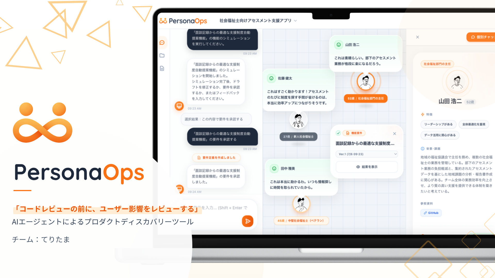
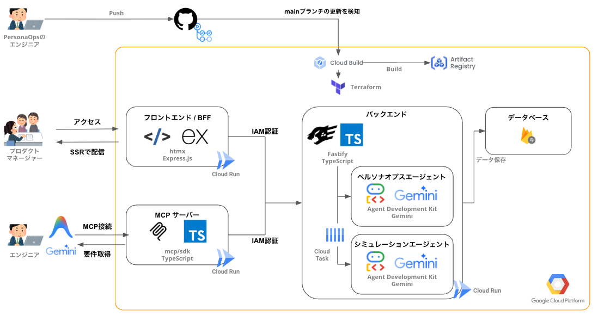
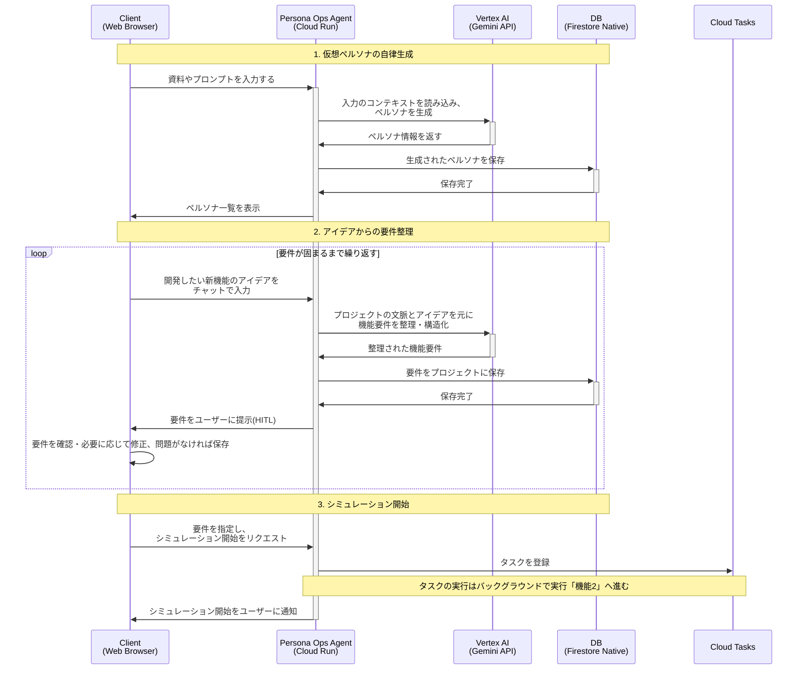
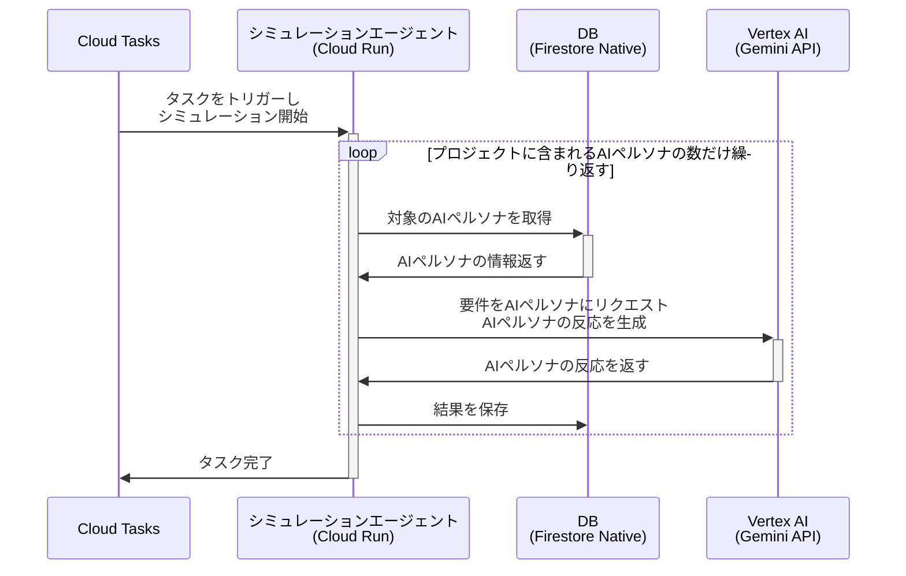
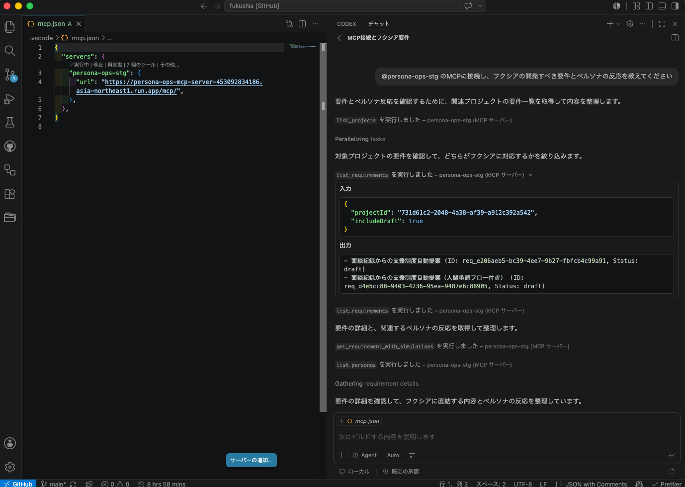

# PersonaOps

> コードレビューの前に、 ユーザー影響をレビューする。  
> それがPersonaOpsです。

(クリックすると YouTube の動画に飛びます)

プロダクトの概要や動作イメージは、下記のProtoPediaの記事を参照ください。

- [PersonaOps | ProtoPedia](https://protopedia.net/prototype/8735)

## 全体構成

本アプリケーションは GCP 上にデプロイされており、mainブランチへのマージでフロントエンドとバックエンドが自動でデプロイされます。

## コアとなるAIエージェント

PersonaOpsでは、2つのAIエージェントがシステムの中核を担っています。

### Persona Ops Agents: ペルソナ生成と要件定義

プロジェクトに関するドキュメントをアップロードすると、AIエージェントがその内容を解析し、ペルソナを生成・要件を整理します。

### Simulation Agent: シミュレーションの実行

準備したペルソナと要件をもとに、AIエージェントが仮想環境でシミュレーションを実行する

### MCPを利用したCoding Agnetとの連携

作成した要件をMCP経由で取得し、開発でそのまま利用することができます。

利用方法は[MCPのREADME.md](./mcp/README.md)を参照ください。

## 各種ドキュメント

### 企画

- [エレベーターピッチ](./docs/elevator_pitch.md)
- [MVPユーザーストーリー](./docs/user_story_mvp.md)
- [ハッカソン規約](./docs/hackathon_rules.md)

### 開発

各コンポーネントの操作方法や設計思想に関しては、下記を確認してください

- 全体
  - [AGENTS.md: 言語に関わらず全体の設計思想や実装に関するルール](./AGENTS.md)
- フロントエンド
  - [README.md: フロントエンドの起動方法や各種コマンドの説明](./frontend/README.md)
  - [AGENTS.md: フロントエンドの設計思想、実装に関するルール](./frontend/AGENTS.md)
- バックエンド
  - [README.md: Private APIサーバーの起動方法や各種コマンドの説明](./api/README.md)
  - [AGENTS.md: Private APIサーバーの設計思想、実装に関するルール](./api/AGENTS.md)
- MCPサーバー
  - [README.md: MCPサーバーの起動方法や各種コマンドの説明](./mcp/README.md)
  - [AGENTS.md: MCPサーバーの設計思想、実装に関するルール](./mcp/AGENTS.md)
- インフラストラクチャ
  - [README.md: GCPやterraformの初期構築手順や各種コマンドの説明](./infra/terraform/README.md)
  - [AGENTS.md: 設計思想、実装に関するルール](./infra/terraform/AGENTS.md)
