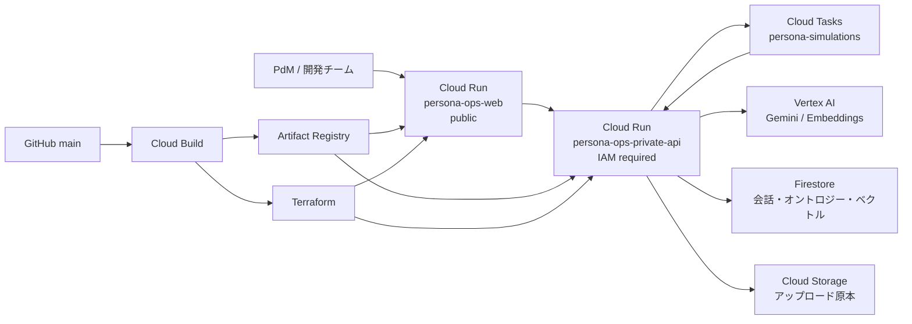

# PersonaOps インフラ・データ設計

## 採用構成

## 実行境界と責務分解の背景

frontendは未認証公開、private APIはIAM認証必須の境界を維持する。ブラウザからprivate APIを直接呼ばず、`persona-ops-web` のserver-sideだけが `persona-ops-private-api` を呼び出す（BFFパターン）。この2層構成を採用した理由は以下の通りである。

- **セキュリティとインフラ権限の分離**: 未認証アクセスを防ぐため、IAM必須の操作（Vertex AI、Firestore等）は全て内部APIに閉じ込める。frontendのサービスアカウントには「APIを呼ぶ権限」のみを与え、最小権限の原則を適用する。
- **関心事の分離 (Separation of Concerns)**: frontend（Express+HTMX）はUI提供に特化し、private API（Fastify+DDD）はビジネスロジックに特化することで、各層をシンプルに保つ。
- **SSR採用の理由**: SPA（Firebase Hosting等）ではなくSSRを採用することで、ブラウザでの複雑なトークン・状態管理を省略し、フロントエンドサーバーのIAM権限で安全かつ透過的にAPIを呼び出す。

## オントロジーの実装境界

Terraformはオントロジーそのものを実装せず、保存先のFirestoreと実行主体のIAMを構築する。オントロジーの型、検証、生成、更新、探索はアプリケーション層の責務とする。

PH1では、次のproperty graph相当のモデルをFirestoreに保存する。

- `projects/{projectId}`: 会話単位のプロジェクト
- `projects/{projectId}/sources/{sourceId}`: URL、ファイル、抽出テキストの来歴
- `projects/{projectId}/entities/{entityId}`: Persona、Role、Goal、Pain、Workflow、Requirementなどの型付きnode
- `projects/{projectId}/relations/{relationId}`: node間の有向edge。関係型、source、確信度、生成日時を保持
- `projects/{projectId}/conversations/{messageId}`: 構造化した会話の長期記憶
- `projects/{projectId}/simulations/{simulationId}`: 要件、対象persona、応答、根拠、判定のスナップショット
- `projects/{projectId}/chunks/{chunkId}`: sourceのchunk、embedding、source位置。Firestore vector searchの対象

nodeとedgeには必ず`schemaVersion`と`evidenceSourceIds`を持たせる。LLMの出力をそのまま保存せず、アプリケーションでJSON Schema等による型検証を行ってから永続化する。これにより、生成結果の変更に追従しながら根拠を遡れる。

## GCPのマネージド選択肢

Google Cloudに、OWL/RDF、推論エンジン、SPARQL endpointを一体で提供する専用の「マネージド・オントロジーサービス」はない。

ネイティブなグラフ機能としてSpanner Graphがあり、property graph、GQL、GraphRAGをサポートする。ただしEnterprise以上のSpannerが必要で、ハッカソンMVPのデータ量に対して常時コストと運用上の複雑さが過大なため採用しない。

MVPではFirestoreのnode/edgeコレクションを採用する。深い多段探索、複雑なGraphRAG、同時更新量が明確に必要になった時点で、同じnode/edgeモデルをSpanner Graphへ移行する。これは将来のための事前実装ではなく、移行判断の境界を明示するものとする。

Vertex AI RAG EngineはRAGパイプラインのマネージドサービスであり、オントロジーサービスではない。現状は小規模・低コストを優先し、Firestore vector searchとVertex AI Embeddingsを組み合わせる。

## ハッカソン要件対応

| 規約                                    | 対応                                                                      |
| --------------------------------------- | ------------------------------------------------------------------------- |
| Google Cloud実行プロダクトを1つ以上利用 | Cloud Run                                                                 |
| Google Cloud AI技術を1つ以上利用        | Vertex AI上のGemini API / Embeddings                                      |
| GitHub連携・CI/CD                       | mainへのpushをCloud Build triggerが検知                                   |
| デプロイ済みURL                         | Terraform output `frontend_service_url` / `api_service_url`               |
| 実運用を見据えたDevOps                  | GitHub Actions CI、remote state、権限分離、immutable image、IaC、validate |
| システム構成図                          | 本文のMermaidを提出用画像へ書き出す                                       |
| 公開GitHubリポジトリ                    | リポジトリ公開設定は提出前に手動確認                                      |
| ProtoPedia動画・タグ・ストーリー        | インフラ外。提出前チェックが必要                                          |

## コスト方針

- Cloud Runはrequest-based、最小0台、上限instanceあり、CPU idleを有効化する。
- ペルソナシミュレーションはCloud Tasksから同じprivate APIへOIDC認証付きで配送し、常駐Workerを持たない。
- Firestoreは無料枠対象の`(default)` databaseを利用する。
- Artifact Registryは直近5イメージを保持し、古いイメージを削除する。
- Cloud Storageのアップロード原本は30日後にNearlineへ移行する。
- Spanner、Cloud SQL、GKE、常時稼働VM、NAT、ロードバランサは作成しない。
- Vertex AIのトークンとembedding生成が主な従量課金になるため、アプリ側で入力上限、chunk重複排除、embedding再利用、利用量計測を実装する。
